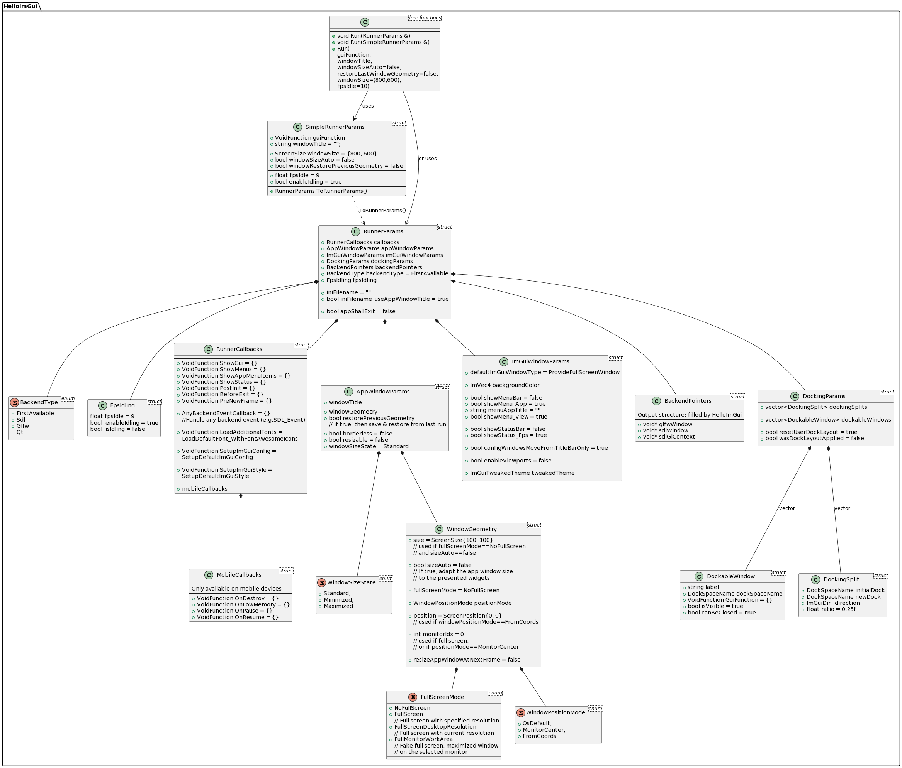
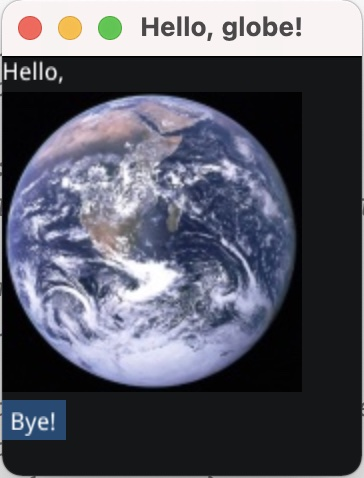

# Hello ImGui

Hello ImGui is a library that enables quickly write multiplatform apps with the simplicity of a "Hello World" app. It is based on [Dear ImGui](https://github.com/ocornut/imgui).

## Features

* Set up a project in 5 minutes
* Advanced layout handling: handle multiple layouts (each of which will remember the user modifications and the list of opened windows). See [demo video](https://www.youtube.com/watch?v=XKxmz__F4ow)
* Embed assets on all platforms
* Power Save mode: reduce FPS when application is idle
* [Theme tweaking](https://www.youtube.com/watch?v=Hhartw0cUjg)
* Window geometry utilities (autosize, restore window position)
* [Truly multiplatform](https://traineq.org/HelloImGui_6_Platforms.mp4) (Linux, Windows, MacOS, iOS, Android, emscripten)


## Get started in 5 minutes

Save this as `hello_world.main.cpp`
```cpp
#include "hello_imgui/hello_imgui.h"
int main(int , char *[])
{
    HelloImGui::Run(
        []{ ImGui::Text("Hello, world!"); }, // Gui code
        "Hello!",                            // Window title
        true                                 // Window size auto
    );
    return 0;
}
```

Save this as `CMakeLists.txt`
```cmake
cmake_minimum_required(VERSION 3.12)
project(helloworld_with_helloimgui)
set(CMAKE_CXX_STANDARD 17)

##########################################################
# Prepare hello_imgui during configure time
##########################################################
include(FetchContent)
FetchContent_Declare(
    hello_imgui
    GIT_REPOSITORY https://github.com/pthom/hello_imgui.git
    # Enter the desired git tag below
    # GIT_TAG
)
FetchContent_MakeAvailable(hello_imgui)
# Make cmake function `hello_imgui_add_app` available
list(APPEND CMAKE_MODULE_PATH ${HELLOIMGUI_CMAKE_PATH})
include(hello_imgui_add_app)

##########################################################
# Build your app
##########################################################
hello_imgui_add_app(hello_world hello_world.main.cpp)
```

Now, build with:

```bash
# Build
mkdir build && cd build && cmake .. && cmake --build . -j 4
# Run the build hello_world app
./hello_world
```

That's it, you do not need to clone HelloImGui, and you do not need to install any third party! 

For more detailed info, go to [_example_integration](_example_integration).


## Do you need more widgets, or do you want to use ImGui with python?

[ ImGuiBundle](https://github.com/pthom/imgui_bundle) is based on HelloImGui and provides lots of additional widgets ([imgui](https://github.com/ocornut/imgui.git), [implot](https://github.com/epezent/implot), [imgui-node-editor](https://github.com/thedmd/imgui-node-editor), [ImFileDialog](https://github.com/pthom/ImFileDialog.git), [ImGuiColorTextEdit](https://github.com/BalazsJako/ImGuiColorTextEdit), [imgui_md](https://github.com/mekhontsev/imgui_md.git)), as well as complete python bindings.

See ImGuiBundle's  [C++ demos](https://github.com/pthom/imgui_bundle/tree/main/demos_cpp) and [Python demos](https://github.com/pthom/imgui_bundle/tree/main/bindings/imgui_bundle/demos).


# Full usage instructions and API

HelloImGui is extremely easy to use: there is **one** main function in the API, with three overloads.

@import "src/hello_imgui/hello_imgui.h" {md_id=HelloImGui::Run}

Although the API is extremely simple, it is highly customizable, and you can set many options by filling the elements in the `RunnerParams` struct, or in the simpler  `SimpleRunnerParams`, or even by giving a subset of params to `HelloImGui::Run`.

Click on the image below to access the [full API doc](src/hello_imgui/hello_imgui_api.md)
[](src/hello_imgui/hello_imgui_api.md)

More info about the how to handle complex layouts in the [docking API](src/hello_imgui/hello_imgui_api.md#docking).


## Online interactive example applications

Click on the images below to run the demonstration applications.

| Hello, World | Advanced Docking | ImGui Manual|
| --- | --- | --- |
| [][hello-world]  | [][docking] | [][manual_online]|
|[Code](src/hello_imgui_demos/hello_world)|[Code](src/hello_imgui_demos/hello_imgui_demodocking)| ImGui Manual is a fully interactive manual for ImGui. [Code](https://github.com/pthom/imgui_manual)|

[hello-world]: https://traineq.org/HelloImGui/bin/hello_world.html  "Hello world"
[docking]: https://traineq.org/HelloImGui/bin/hello_imgui_demodocking.html  "Advanced docking demo"
[classic]: https://traineq.org/HelloImGui/bin/hello-imgui-demo-classic.html  "ImGui classic demo"
[manual_online]: https://pthom.github.io/imgui_manual_online/  "ImGui Manual"


## Demo - handle events and include assets:



#### include assets
Anything in the assets/ folder located beside the app's CMakeLists will be embedded in the app:
```
└── hello_globe.main.cpp
├── CMakeLists.txt
├── assets/
│         └── world.jpg
```
(even on iOS and emscripten).

#### handle events
Dear ImGui uses the Immediate Gui paradigm: each button, each widget returns true if the user interacted with it.

> hello_globe.main.cpp
```cpp
#include "hello_imgui/hello_imgui.h"
int main(int , char *[])
{
    auto guiFunction = []() {
        ImGui::Text("Hello, ");                    // Display a simple label
        HelloImGui::ImageFromAsset("world.jpg");   // Display a static image
        if (ImGui::Button("Bye!"))                 // Display a button
            // and immediately handle its action if it is clicked!
            HelloImGui::GetRunnerParams()->appShallExit = true;
     };
    HelloImGui::Run(guiFunction, "Hello, globe", true);
    return 0;
}
```

The CMakeLists fits in two lines, and will work on Linux, Mac, Windows, iOS and Emscripten_
> CMakeLists.txt:
```cmake
include(hello_imgui_add_app)
hello_imgui_add_app(hello_globe hello_globe.main.cpp)
```


## Complete demo - advanced layout, FPS, theme, etc:

The C++ demo file [hello_imgui_demodocking.main.cpp](src/hello_imgui_demos/hello_imgui_demodocking/hello_imgui_demodocking.main.cpp) demonstrates:

* How to handle complex layouts: you can define several layouts and switch between them:  each layout which will remember the user modifications and the list of opened windows
* How to use theming
* How to store you own user settings in the app ini file
* How to add a status bar and a log window
* How to set an adaptative FPS for your application (to reduce CPU usage)

You can try this demo online via an [emscripten web demo](https://traineq.org/HelloImGui/bin/hello_imgui_demodocking.html). It is also available [in python](https://github.com/pthom/imgui_bundle/blob/main/bindings/imgui_bundle/demos_python/demos_immapp/demo_docking.py), inside [Dear ImGui Bundle](https://github.com/pthom/imgui_bundle)

Also, see this video that give more explanations on [how to handle multiple complex layouts](https://www.youtube.com/watch?v=XKxmz__F4ow)


-------------------
__Table of contents__

[TOC]

--------------------

# Main signature: use `int main(int, char**)`

Under windows, Hello ImGui will automatically provide a [`WinMain()` function](hello_imgui_cmake/HelloImGui_WinMain.cpp) that will call main, and expects its signature to be `int main(int, char**)`. You may get a linker error if your main function signature is for example `int main()`.

You can disable this via cmake by passing `-DHELLOIMGUI_WIN32_AUTO_WINMAIN=OFF` as a command line cmake option. In this case, write your own `WinMain` under windows.

Warning: if using SDL, you will need to `#define SDL_MAIN_HANDLED` before any inclusion of SDL.h (to refrain SDL from #defining  `#define main SDL_main`)

# Build instructions

## Supported platforms and backends

**Platforms:**  Windows, Linux, OSX, iOS, Emscripten, Android (poorly supported)

**Backends:**: SDL2 + OpenGL 3 or OpenGLES3 for mobile devices, Glfw3 + OpenGL 3

## Clone the repository

```bash
git clone https://github.com/pthom/hello_imgui.git
cd hello_imgui
git submodule update --init
```

## Easy build on desktop platforms using Glfw
On Desktop platforms (Linux, MacOS, Windows), if  you do not specify any backend option, HelloImGui will automatically download Glfw and link with it.

```bash
mkdir build
cd build 
cmake ..
make -j
```


## Custom build: select your preferred backend

In order to select your own backend, use one of the cmake options below:
```bash
cmake .. -DHELLOIMGUI_WITH_GLFW=ON            # To download and build glfw automatically
cmake .. -DHELLOIMGUI_WITH_SDL=ON             # To download and build SDL automatically
cmake .. -DHELLOIMGUI_USE_GLFW_OPENGL3=ON      # To use your own version of GLFW (it should be findable via find_package(glfw3))
cmake .. -DHELLOIMGUI_USE_SDL_OPENGL3=ON       # To use your own version of SDL (it should be findable via find_package(SDL2))
```


## Build instructions for iOS

"SDL + OpenGL ES3" is currently the preferred backend for iOS.

This project uses the [ios-cmake](https://github.com/leetal/ios-cmake) toolchain which is a submodule in the folder [hello_imgui_cmake/ios-cmake](hello_imgui_cmake/ios-cmake).

1. First, you need to download SDL : launch [tools/sdl_download.sh](tools/sdl_download.sh), which will download SDL into a symlink inside "external/SDL"

```bash
.tools/sdl_download.sh
```

Alternatively, download [SDL2-2.24.2.tar.gz](https://www.libsdl.org/release/SDL2-2.24.2.tar.gz) and extract it into external/SDL.

2. Launch cmake with correct team and bundle url parts:

Adapt the command below, by:
* adding your own development team Id after `-DCMAKE_XCODE_ATTRIBUTE_DEVELOPMENT_TEAM=` , 
* setting HELLO_IMGUI_BUNDLE_IDENTIFIER_URL_PART (for example `-DHELLO_IMGUI_BUNDLE_IDENTIFIER_URL_PART=com.org_name_or_email`)
* setting the correct platform (-DPLATFORM): see https://github.com/leetal/ios-cmake (-DPLATFORM=OS64COMBINED will build for iOS and its simulator).
````bash
mkdir build_ios_sdl
cd build_ios_sdl
cmake .. \
  -GXcode \
  -DCMAKE_TOOLCHAIN_FILE=../hello_imgui_cmake/ios-cmake/ios.toolchain.cmake \
  -DHELLOIMGUI_USE_SDL_OPENGL3=ON \
  -DPLATFORM=OS64COMBINED \
  -DCMAKE_XCODE_ATTRIBUTE_DEVELOPMENT_TEAM=... \
  -DHELLO_IMGUI_BUNDLE_IDENTIFIER_URL_PART=... \
  ..
````

_Notes about apps bundle identifiers: each app built for iOS needs to have a unique Bundle identifier (this is required by Apple). 
When using HelloImGui, this ID is a concatenation of HELLO_IMGUI_BUNDLE_IDENTIFIER_URL_PART and HELLO_IMGUI_BUNDLE_IDENTIFIER_NAME_PART, which
you can specify as cmake arguments via the command line (by default HELLO_IMGUI_BUNDLE_IDENTIFIER_NAME_PART will be the name of the app
given to `hello_imgui_add_app`)

See [hello_imgui_cmake/ios/hello_imgui_ios.cmake](hello_imgui_cmake/ios/hello_imgui_ios.cmake):
```
  set(HELLO_IMGUI_BUNDLE_IDENTIFIER ${HELLO_IMGUI_BUNDLE_IDENTIFIER_URL_PART}.${HELLO_IMGUI_BUNDLE_IDENTIFIER_NAME_PART})
```
and [hello_imgui_cmake/ios/info_plist/sdl/Info.plist.in](hello_imgui_cmake/ios/info_plist/sdl/Info.plist.in).

### Customizing the iOS build

See [Embed assets and customize apps](#embed-assets-and-customize-apps)
 
---

## Build instructions for emscripten

> [emscripten](https://emscripten.org/) is a toolchain for compiling to asm.js and WebAssembly, built using LLVM, that lets you run C and C++ on the web at near-native speed without plugins.

### Install the requirements (emsdk)

You can either install emsdk following [the instruction on the emscripten website](https://emscripten.org/docs/getting_started/downloads.html) or you can use the script [tools/emscripten/install_emscripten.sh](tools/emscripten/install_emscripten.sh).

````bash
../tools/emscripten/install_emscripten.sh
````

This script will download and install emscripten into `~/emsdk`

### Build for emscripten

1. Add emsdk to your shell path;

You need to **source** the script ~/emsdk/emsdk_env.sh

```bash
source ~/emsdk/emsdk_env.sh
```

2. Run cmake, using "emcmake":

````bash
mkdir build_emscripten
cd build_emscripten
emcmake cmake ..
````

3. Build

```bash
make -j 4
```

4. Test your emscripten application

You will need a web server. Python provides a basic web server that is easy to usen which you can launch like this:

````bash
cd build_emscripten
python3 -m http.server
````

Open a browser, and navigate to [http://localhost:8000](http://localhost:8000).

For example, the docking demo will be available at 
[http://localhost:8000/src/hello_imgui_demos/hello_imgui_demodocking/hello_imgui_demodocking.html](http://localhost:8000/src/hello_imgui_demos/hello_imgui_demodocking/hello_imgui_demodocking.html)

### Customizing the emscripten build

Refer to the [emscripten docs](https://emscripten.org/)

By default, the application will be presented inside an empty html page. 
You can adapt this page by modyfing the "shell": copy the file [hello_imgui_cmake/emscripten/shell.emscripten.html](hello_imgui_cmake/emscripten/shell.emscripten.html)
into your app source dir, and adapt it to your needs. 
 
---

## Build and deploy instructions for Android

The Android version uses SDL + OpenGLES3.

_Note: The Android version is currently not actively maintained._

### Download SDL 

You need to download SDL manually for Android, like this:

```bash
./tools/sdl_download.sh
```

### Set Android required environment variables

```bash
export ANDROID_HOME=/path/to/AndroidSdk
export ANDROID_NDK_HOME=/path/to/AndroidNdk
```

For example (MacOS):

```bash
export ANDROID_HOME=/Users/Me/Library/Android/sdk
export ANDROID_NDK_HOME=/Users/Me//Library/Android/sdk/ndk/21.3.6528147
```

If `ANDROID_NDK_HOME` is unset, by default, the scripts will look for Android-ndk inside `$ANDROID_HOME/ndk-bundle`.

### Run cmake in order to create an Android studio project

The script [tools/android/cmake_arm-android.sh](tools/android/cmake_arm-android.sh)  will invoke cmake with the android toolchain, and also _create an Android Studio project_ which
is multiarch (arm64-v8a, armeabi-v7a, etc), via the option `-DHELLOIMGUI_CREATE_ANDROID_STUDIO_PROJECT=ON` (see [tools/android/_impl_cmake_android.sh](tools/android/_impl_cmake_android.sh))


Run the following commands:

```bash
mkdir build_android
cd build_android
../tools/android/cmake_arm-android.sh
```

Your build directory will now look like this:

```
build_android/
├── CMakeCache.txt
├── ...
├── hello-imgui-demo-classic_AndroidStudio/
├── hello_imgui_demo_minimal_AndroidStudio/
├── hello_imgui_demodocking_AndroidStudio/
├── hello_world_AndroidStudio/
├── ...
```

The folders "xxxx_AndroidStudio" contain Android Studio projects, which you can use to build and debug your app.

You can now open (for example) the project hello_imgui_demodocking_AndroidStudio with Android Studio and run it / debug it.

You can also build the project manually via gradlew like this:

```bash
export JAVA_HOME=/Library/Java/JavaVirtualMachines/adoptopenjdk-8.jdk/Contents/Home 
cd hello_imgui_demodocking_AndroidStudio
./gradlew build
```

_Note: (you need to first set JAVA_HOME to the correct java version (Android requires exactly jdk8), the path given here is for MacOS users, where adoptopenjdk provides the correct version)_

You can also install the app via command line, like this:

```bash
./gradlew installDebug
```

---

# Embed assets and customize apps

## Embed assets

Anything in the assets/ folder located beside the app's CMakeLists will be embedded
on mobile devices and emscripten, i.e they will be bundled together with the app; and you can access them via `assetFileFullPath(const std::string& assetRelativeFilename)`.

## Customize per platform 

### iOS

For iOS, simply create a folder named "ios" beside the application 'CMakeLists.txt'. There, you can add a custom Info.plist, as well as app icons and launch screens.

### Android 

For Android, simply create a folder named "android" beside the application 'CMakeLists.txt'. There, you can add a custom "res/" folder, containing your icons and application settings inside "res/values/".


## Example of customization:

```
hello_imgui_democking/
├── CMakeLists.txt                              # The app's CMakeLists
├── hello_imgui_demodocking.main.cpp            # its source code
│
│
├── assets/                                     # Anything in the assets/ folder located
│         └── fonts/                                  # beside the app's CMakeLists will be embedded
│             └── Akronim-Regular.ttf                 # on mobile devices and emscripten             
│
│
├── android/                                    # android/ is where you customize the Android App
│         ├── mipmap-source/
│         │         ├── Readme.md
│         │         └── ic_launcher.png                     # an icon that helps creating the different sizes
│         └── res/                                    # anything in the res/ folder will be embedded as a resource
│             ├── mipmap-hdpi/
│             │         └── ic_launcher.png                 # icons with different sizes
│             ├── mipmap-mdpi/
│             │         └── ic_launcher.png
│             ├── mipmap-xhdpi/
│             │         └── ic_launcher.png
│             ├── mipmap-xxhdpi/
│             │         └── ic_launcher.png
│             ├── mipmap-xxxhdpi/
│             │         └── ic_launcher.png
│             └── values/
│                 ├── colors.xml
│                 ├── strings.xml                    # Customize the application icon label here
│                 └── styles.xml
│
│
└── ios/                                        # ios/ is where you customize the iOS App
    │
    ├── Info.plist                              # If present, this Info.plist will be applied 
    │                                           # (if not, a default is provided)
    │                                           # You can there customize the App icon name, etc.
    │
    └── icons/                                  # Icons and Launch images placed inside icons/ 
        ├── Default-375w-812h@3x.disabled.png   # will be placed in the application bundle 
        ├── Default-568h@2x.png                 # and thus used by the app
        ├── Default.png
        ├── Icon.png
        └── Readme.md

```

### Resizing icons for Android

You can use the script [tools/android/resize_icons.py](tools/android/resize_icons.py) in order 
to quickly create the icons with all the required sizes.

@import "tools/android/resize_icons.py" {md_id=resize_icons}

-------

# Real world examples

## ImGui Manual

[ImGui Manual](https://github.com/pthom/imgui_manual) is an interactive manual for [Dear ImGui](https://github.com/ocornut/imgui), which uses Hello ImGui.

Just click on the image below to open it:

[](https://pthom.github.io/imgui_manual_online/)

## CatSight

[CatSight](https://github.com/codecat/catsight) is a cross-platform process memory inspector.

## Example of an app using HelloImGui as a submodule

[hello_imgui_my_app](https://github.com/pthom/hello_imgui_my_app) is a separate repo that gives a working example on how to use the library as a submodule.

---

# Alternatives

[OpenFrameworks](https://openframeworks.cc/) and [Cinder](https://libcinder.org/) are alternatives in order to quickly start a C++ application under many platforms.

Being oriented for creative coding, they are much more feature rich, offers some level of native hardware access (camera, accelerometer), but they are also less lightweight than ImGui + HelloImGui.

[sokol_app](https://github.com/floooh/sokol#sokol_apph) is a minimal cross-platform application-wrapper library.

# Online interactive development platform

You can test developping with Hello ImGui in 1 minute, *without even installing anything*, thanks to [Gitpod.io](https://gitpod.io)'s online development platform: [Open Hello ImGui inside Gitpod](https://gitpod.io/#https://github.com/pthom/hello_imgui/) (58 seconds [demo video](https://www.youtube.com/watch?v=1cgemZQ2CMc) on youtube)
