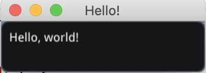

# Hello, Dear ImGui

_HelloImGui_ is a library that enables to write  multiplatform Gui apps for Windows, Mac, Linux, iOS, Android, emscripten; with the simplicity of a "Hello World" app!

It is based on [Dear ImGui](https://github.com/ocornut/imgui), a Bloat-free Immediate Mode Graphical User interface for C++ with minimal dependencies.

__Online Emscripten/Wasm demos:__


| Hello, World | Advanced Docking | Classic ImGui Demo
| --- | --- | --- |
| [][hello-world]  | [][docking]  | [][classic]

[hello-world]: https://traineq.org/HelloImGui/hello_imgui_demos/hello_world/hello_world.html  "Hello world"
[docking]: https://traineq.org/HelloImGui/hello_imgui_demos/hello_imgui_demodocking/hello_imgui_demodocking.html  "Advanced docking demo"
[classic]: https://traineq.org/HelloImGui/hello_imgui_demos/hello_imgui_demo_classic/hello-imgui-demo-classic.html  "ImGui classic demo"

----

__Table of contents__

[TOC]

----

# Examples

## Hello, world!

With HelloImGui, the equivalent of the "Hello, World!" can be written with 8 C++ lines + 2 CMake lines:

 [Online demo][hello-world]

[__hello_word.main.cpp__](src/hello_imgui_demos/hello_world/hello_world.main.cpp)
`````cpp
#include "hello_imgui/hello_imgui.h"
int main()
{
    HelloImGui::Run(
        []{ ImGui::Text("Hello, world!"); }, // Gui code
        { 200.f, 50.f },                     // Window Size
        "Hello!" );                          // Window title
}
`````

[__CMakeLists.txt__](src/hello_imgui_demos/hello_world/CMakeLists.txt):
````cmake
include(${CMAKE_CURRENT_LIST_DIR}/../../hello_imgui/helloimgui_add_app_cmake/helloimgui_add_app.cmake)
helloimgui_add_app(hello_world hello_world.main.cpp)
````

_Although this app was extremely simple to write, it will run with no additional modifications (including in the cmake code) on iOS, Linux, Mac, Windows and Emscripten, and hopefuly soon Android_

Source for this example: [src/hello_imgui_demos/hello_world](src/hello_imgui_demos/hello_world)

## Advanced example with docking support

This example showcases various features of _Hello ImGui_.
 [Online demo][docking]

Source for this example: [src/hello_imgui_demos/hello_imgui_demodocking](src/hello_imgui_demos/hello_imgui_demodocking)

## Example of an app using HelloImGui as a submodule

[hello_imgui_my_app](https://github.com/pthom/hello_imgui_my_app) is a separate repo that gives a working example on how to use the library as a submodule in a separate application. 

## ImGui "classic" demo

This example reproduces ImGui default example.

 [Online demo][classic]

Source for this example: [src/hello_imgui_demos/hello_imgui_demo_classic](src/hello_imgui_demos/hello_imgui_demo_classic)


# Features

* Docking support (based on ImGui [docking branch](https://github.com/ocornut/imgui/tree/docking))
* Default docking layout + View menu with option to restore the layout
* Status bar
* Log widget
* Zoom (especialy useful for mobile devices)
* Mobile apps specific callbacks (OnPause, OnResume, OnLowMemory)
* Mobile apps customization (icon, embedded files, etc)


# Supported platforms and backends

## Platforms
* Windows
* Linux
* OSX
* iOS
* emscripten
* Android : being developed

## Backends 
* SDL2 + OpenGL 3 or OpenGLES3 for mobile devices
* Glfw3 + OpenGL 3
* Qt

Adding new backends should be easy: simply add a new derivate of [AbstractRunner](src/hello_imgui/internal/backend_impls/abstract_runner.h).

# Usage instructions and API

_RunnerParams_ contains all the settings and callbacks in order to run an application. 

> _[These settings are explained in details in the API Doc](src/hello_imgui/hello_imgui_api.md)_


# Build instructions

## Clone the repository
````bash
git clone https://github.com/pthom/hello_imgui.git
cd hello_imgui
git submodule update --init
````

## Build instructions for desktop platforms (Linux, MacOS, Windows)

### Select your backend

Several cmake options are provided: you need to select at least one backend:
````cmake
option(HELLOIMGUI_USE_SDL_OPENGL3 "Build HelloImGui for SDL+OpenGL3" OFF)
option(HELLOIMGUI_USE_GLFW_OPENGL3 "Build HelloImGui for GLFW+OpenGL3" OFF)
option(HELLOIMGUI_USE_QT "Build HelloImGui for Qt" OFF)
option(HELLOIMGUI_USE_SDL_DIRECTX11 "Build HelloImGui for SDL+DirectX11" OFF)
````

_"HELLOIMGUI_USE_SDL_OPENGL3" is the preferred backend, since it works under all platforms (windows, linux, osx, android, emscripten, iOS). On Mobile platforms, it will use OpenGLES3._

### Install Glfw3 and Sdl2 via vcpkg 

If you intend to use SDL of glfw, you can either use your own installation or have them installed automatically via [vcpkg](https://github.com/Microsoft/vcpkg):

Simply run this command:
````bash
./tools/vcpkg_install_third_parties.py
````

This script will download and build vcpkg, then install sdl2 and Glfw3 into `hello_imgui/vcpkg/`

### Backend with SDL2 + OpenGL3

If you intend to use SDL provided by vcpkg use the following instructions:
````bash
mkdir build
cd build
cmake -DCMAKE_TOOLCHAIN_FILE=../vcpkg/scripts/buildsystems/vcpkg.cmake  -DHELLOIMGUI_USE_SDL_OPENGL3=ON ..
make -j4
````

If you intend to use your own SDL installation, simply remove the argument "-DCMAKE_TOOLCHAIN_FILE".

#### Warning: main() signature with SDL

@import "src/hello_imgui/hello_imgui.h" {md_id=SDLMain}

### Backend with with Glfw3 + OpenGL3

Follow the instructiosn for SDL2, but replace HELLOIMGUI_USE_SDL_OPENGL3 by HELLOIMGUI_USE_GLFW_OPENGL3.

### Backend with Qt

Requirements:
* You need to have Qt >= 5.10 installed
* The Qt backend uses [qtimgui](https://github.com/seanchas116/qtimgui) , which you need to download into external/qutimgui.
  You can use the script [tools/qtimgui_download.py](tools/qtimgui_download.py) in order to download it
  in one step.

Usage: simply pass the option `-DHELLOIMGUI_USE_QT=ON` and specify the path to Qt via CMAKE_PREFIX_PATH.

For example, this line would build with Qt backend for an androïd_armv7 target:

````bash
cmake -DCMAKE_PREFIX_PATH=/path/to/Qt/5.12.8/clang_64 -DHELLOIMGUI_USE_QT=ON
````

----

## Build instructions for iOS

"SDL + OpenGL ES3" is currently the preferred backend for iOS.

This project uses the [ios-cmake](https://github.com/leetal/ios-cmake) toolchain which is a submodule in the folder [hello_imgui_cmake/ios-cmake](hello_imgui_cmake/ios-cmake).

### Install requirements

1. First, you need to download and compile SDL

Launch [tools/ios/sdl_compile_ios.sh](tools/ios/sdl_compile_ios.sh), which will download and compile SDL for iOS and the simulator, into the folder "external/SDL"

````bash
./tools/ios/sdl_compile_ios.sh
````


2. Set your development team Id inside [tools/ios/set_dev_team.source](tools/ios/set_dev_team.source)

Edit the file and replace the id with your own team id.
````bash
export CMAKE_XCODE_ATTRIBUTE_DEVELOPMENT_TEAM="0123456789"
````

### Build for iOS

1. **Source** tools/ios/set_dev_team.source in order to add the CMAKE_XCODE_ATTRIBUTE_DEVELOPMENT_TEAM environment variable

````bash
source tools/ios/set_dev_team.source
````

2. Launch cmake using [./tools/ios/cmake_ios_sdl.sh](tools/ios/cmake_ios_sdl.sh):

````bash
./tools/ios/cmake_ios_sdl.sh
````

This will create a build directory named "build_ios_sdl/" and then open the project "HelloImGui.xcodeproj".

If you want to run cmake by yourself, here are the required commands:
`````bash
mkdir build_ios_sdl
cd build_ios_sdl
export CMAKE_XCODE_ATTRIBUTE_DEVELOPMENT_TEAM=YourTeamIdHere
cmake .. \
  -GXcode \
  -DCMAKE_TOOLCHAIN_FILE=../hello_imgui_cmake/ios-cmake/ios.toolchain.cmake \
  -DHELLOIMGUI_USE_SDL_OPENGL3=ON \
  -DPLATFORM=OS64 \
  -DENABLE_BITCODE=OFF \
  .. \
`````

### Customizing the iOS build

See [Embed assets and customize apps](#embed_assets_and_customize_apps)
 
----

## Build instructions for emscripten

> [emscripten](https://emscripten.org/) is a toolchain for compiling to asm.js and WebAssembly, built using LLVM, that lets you run C and C++ on the web at near-native speed without plugins.

### Install the requirements (emsdk)

You can either install emsdk following [the instruction on the emscripten website](https://emscripten.org/docs/getting_started/downloads.html) or you can use the script [tools/emscripten/cmake_emscripten.sh](tools/emscripten/cmake_emscripten.sh).

`````bash
./tools/emscripten/cmake_emscripten.sh
`````

This script will download and install emscripten into `~/emsdk`

### Build for emscripten

1. Add emsdk to your shell path;

You need to **source** the script ~/emsdk/emsdk_env.sh

````bash
source ~/emsdk/emsdk_env.sh
````

2. Run cmake, using "emcmake":

`````bash
mkdir build_emscripten
cd build_emscripten
emcmake cmake .. -DHELLOIMGUI_USE_SDL_OPENGL3=ON ..
`````

Note: the script [tools/emscripten/cmake_emscripten.sh](tools/emscripten/cmake_emscripten.sh) does exactly this.

3. Build

````bash
make -j 4
````

4. Test your emscripten application

You will need a web server. Python provides a basic web server that is easy to usen which you can launch like this:

`````bash
cd build_emscripten
python3 -m http.server
`````

Open a browser, and navigate to [http://localhost:8000](http://localhost:8000).

For example, the docking demo will be available at 
[http://localhost:8000/src/hello_imgui_demos/hello_imgui_demodocking/hello_imgui_demodocking.html](http://localhost:8000/src/hello_imgui_demos/hello_imgui_demodocking/hello_imgui_demodocking.html)

### Customizing the emscripten build

Refer to the [emscripten docs](https://emscripten.org/)

By default, the application will be presented in an empty html page. You can adapt [hello_imgui_cmake/emscripten/runner_emscripten_shell.html](hello_imgui_cmake/emscripten/runner_emscripten_shell.html) if you want.

----

## Build instructions for Android

Android support is being developed : as I do not own an Android device, help would be appreciated.
Currently, the code correctly compiles and link for Android; however no apk is currently generated.

See [Android_status.md](Android_status.md) for more info.

# Embed assets and customize apps

## Embed assets
Anything in the assets/ folder located beside the app's CMakeLists will be embedded
on mobile devices and emscripten, i.e they will be bundled together with the app; 
and you can access them via `assetFileFullPath(const std::string& assetRelativeFilename)`.

## Customize per platform 
For iOS, simply create a folder named "ios" beside the application 'CMakeLists.txt'
There, you can add a custom Info.plist, as well as app icons and launch screens.

## Example of customization:
````
hello_imgui_democking/
├── CMakeLists.txt                              # The app's CMakeLists
├── hello_imgui_demodocking.main.cpp            # its source code
|
├── assets/                                     # Anything in the assets/ folder located
│   └── fonts/                                  # beside the app's CMakeLists will be embedded
│       └── Akronim-Regular.ttf                 # on mobile devices and emscripten             
|
└── ios/                                        # ios/ is where you customize the iOS App
    |
    ├── Info.plist                              # If present, this Info.plist will be applied 
    |                                           # (if not, a default is provided)
    |                                           # You can there customize the App icon name, etc.
    |
    └── icons/                                  # Icons and Launch images placed inside icons/ 
        ├── Default-375w-812h@3x.disabled.png   # will be placed in the application bundle 
        ├── Default-568h@2x.png                 # and thus used by the app
        ├── Default.png
        ├── Icon.png
        └── Readme.md
````

----

# Alternatives

[OpenFrameworks](https://openframeworks.cc/) is another alternative in order to quickly start a C++ application under many platforms. 

Being oriented for creative coding, it is much more feature rich, offers some level of native hardware access (camera, accelerometer), but it is also less lightweight than ImGui + HelloImGui, .
