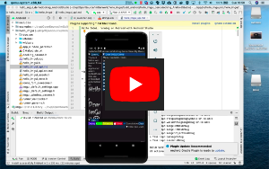
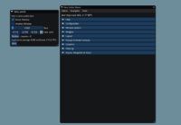

# Hello, Dear ImGui

_HelloImGui_ is a library that enables to write  multiplatform Gui apps for Windows, Mac, Linux, iOS, Android, emscripten; with the simplicity of a "Hello World" app. It is based on [Dear ImGui](https://github.com/ocornut/imgui), a Bloat-free Immediate Mode Graphical User interface for C++ with minimal dependencies.


A hello world app can be written in one single call: just write a lambda that contains the GUI code, and specify the window size and title.
````cpp
HelloImGui::Run(
    []{ ImGui::Text("Hello, world!"); }, // GUI code: this lambda will display a single label
    { 200.f, 50.f },                     // window size
    "Hello!" );                          // window title
`````


A slightly more complex multiplatform app, including assets and callbacks is also extremely simple to write. The "Hello Globe" app shown below is composed with three simple files. It will run with no additional modifications (including in the cmake code) on iOS, Android, Linux, Mac, Windows and Emscripten_


````
└── hello_globe.main.cpp   // main file, see below
├── CMakeLists.txt         // 2 lines of cmake, for all platforms!
├── assets/
│   └── world.jpg          // assets are embedded automatically, even on mobile platforms!
````
(Anything in the assets/ folder located beside the app's CMakeLists will be embedded on mobile devices and emscripten, i.e they will be bundled together with the app).

> hello_globe.main.cpp
````cpp
#include "hello_imgui/hello_imgui.h"
int main(int , char *[])
{
    // Instantiate RunnerParams which will contains all the application params and callbacks
    HelloImGui::RunnerParams runnerParams;

    // ShowGui contains a function with the Gui code
    runnerParams.callbacks.ShowGui = [&runnerParams] {
        // Display a simple label
        ImGui::Text("Hello, ");
        // Display a static image, taken from assets/world.jpg,
        // assets are embedded automatically into the app (for *all* platforms)
        HelloImGui::ImageFromAsset("world.jpg");   

        // Display a button
        if (ImGui::Button("Bye!"))
            // ... and immediately handle its action if it is clicked!
            // here, the flag appShallExit will tell HelloImGui to end the app. 
            runnerParams.appShallExit = true;
    };
    // Set the app windows parameters
    runnerParams.appWindowParams.windowTitle = "Hello, globe!";
    runnerParams.appWindowParams.windowSize = {180.f, 210.f};

    // Run the app
    HelloImGui::Run(runnerParams);
    return 0;
}
````

> CMakeLists.txt:
> hello_imgui_add_app will create the app and embed all its assets, for all platforms.
````cmake
include(hello_imgui_add_app)
hello_imgui_add_app(hello_globe hello_globe.main.cpp)
````

__Truly multiplatform (desktop and mobile)__

HelloImGui target desktop platforms (Linux, OSX, Windows), but also mobile platforms (iOS and Android), 
as well as the web browser (via wasm/emscripten).

The movie belows showing Hello ImGui running on 6 platforms!

[ ](https://traineq.org/HelloImGui_6_Platforms.mp4)


__Online interactive example applications__

Since HelloImGui also compile to wasm, applications created with it can be displayed in a browser. 
Click on the images below to run the demonstration applications. 


| Hello, World | Advanced Docking | Classic ImGui Demo | ImGui Manual
| --- | --- | --- | --- |
| [][hello-world]  | [][docking]  | [][classic] | [][manual_online]
|[Code](src/hello_imgui_demos/hello_world)|[Code](src/hello_imgui_demos/hello_imgui_demodocking)|[Code](src/hello_imgui_demos/hello_imgui_demo_classic)| ImGui Manual is a fully interactive manual for ImGui. [Code](https://github.com/pthom/imgui_manual)

[hello-world]: https://traineq.org/HelloImGui/hello_imgui_demos/hello_world/hello_world.html  "Hello world"
[docking]: https://traineq.org/HelloImGui/hello_imgui_demos/hello_imgui_demodocking/hello_imgui_demodocking.html  "Advanced docking demo"
[classic]: https://traineq.org/HelloImGui/hello_imgui_demos/hello_imgui_demo_classic/hello-imgui-demo-classic.html  "ImGui classic demo"
[manual_online]: https://pthom.github.io/imgui_manual_online/  "ImGui Manual"


__Online interactive development platform__

You can test developping with Hello ImGui in 1 minute, *without even installing anything*, thanks to [Gitpod.io](https://gitpod.io)'s online development platform: [Open Hello ImGui inside Gitpod](https://gitpod.io/#https://github.com/pthom/hello_imgui/) (58 seconds [demo video](https://www.youtube.com/watch?v=1cgemZQ2CMc) on youtube)


-------------------
__Table of contents__

[TOC]

--------------------

# Features

* Truly multiplatform (including mobile platforms)
* Setup a project with 2 CMake lines
* Embed assets with no code (on all platforms)
* Mobile apps specific callbacks (OnPause, OnResume, OnLowMemory), and customization (icon, embedded files, etc)
* Additional widgets: status bar, log widget
* Zoom (especialy useful for mobile devices)
* Easy docking setup, with a "View" menu with options in order to show/hide the dockable windows, and to restore the default layout. 


# Usage instructions and API

_RunnerParams_ contains all the settings and callbacks in order to run an application. 

[](src/hello_imgui/hello_imgui_api.md)

* See how to setup an application [in the API Doc](src/hello_imgui/hello_imgui_api.md)
* More details about the [docking API](src/hello_imgui/hello_imgui_api.md#docking)


# Supported platforms and backends

## Platforms

* Windows
* Linux
* OSX
* iOS
* emscripten
* Android

## Backends

* SDL2 + OpenGL 3 or OpenGLES3 for mobile devices
* Glfw3 + OpenGL 3
* Qt

Adding new backends should be easy: simply add a new derivate of [AbstractRunner](src/hello_imgui/internal/backend_impls/abstract_runner.h).


# Build instructions

> Note: If you want to use HelloImGui in your own application, you may also want to look at [hello_imgui_my_app](https://github.com/pthom/hello_imgui_my_app), which is a separate repo that gives a working example on how to use the library as a submodule.
  
## Clone the repository

````bash
git clone https://github.com/pthom/hello_imgui.git
cd hello_imgui
git submodule update --init
````

## Build instructions for desktop platforms (Linux, MacOS, Windows)

### Select your backend

Several cmake options are provided: you need to select at least one backend:

````cmake
option(HELLOIMGUI_USE_SDL_OPENGL3 "Build HelloImGui for SDL+OpenGL3" OFF)
option(HELLOIMGUI_USE_GLFW_OPENGL3 "Build HelloImGui for GLFW+OpenGL3" OFF)
option(HELLOIMGUI_USE_QT "Build HelloImGui for Qt" OFF)
````

"HELLOIMGUI_USE_SDL_OPENGL3" is the preferred backend, since it works under all platforms (windows, linux, osx, android, emscripten, iOS). On Mobile platforms, it will use OpenGLES3. Use it with `cmake .. -DHELLOIMGUI_USE_SDL_OPENGL3=ON`

### Plug your backend

#### Option 1: plug your backend manually

You can install your backend by any mean (global install, Conan, submodule, etc). 

Before adding the hello_imgui directory (`add_subdirectory(hello_imgui)`), just make 
sure that your backend is available, and select it via one of the variables HELLOIMGUI_USE_SDL_OPENGL3, 
HELLOIMGUI_USE_GLFW_OPENGL3, or HELLOIMGUI_USE_QT).

For example, the cmake script below works for the GLFW backend:

````cmake
  # Here, glfw was added as a submodule into a folder "glfw"
  add_subdirectory(glfw) 
  # We instruct HelloImgui to use glfw
  set(HELLOIMGUI_USE_GLFW_OPENGL3 ON CACHE BOOL "" FORCE)
  # And add HelloImGui
  add_subdirectory(hello_imgui)
````

#### Option 2: plug SDL or Glfw3 via vcpkg

[Vcpkg](https://github.com/Microsoft/vcpkg) is a C++ Library Manager for Windows, Linux, and MacOS (support for iOS and Android is coming).

If you intend to use SDL of glfw, you can have them installed automatically via Vcpkg: simply run this command:

````bash
./tools/vcpkg_install_third_parties.py
````

This script will download and build vcpkg, then install sdl2 and Glfw3 into `hello_imgui/vcpkg/`

You can then build HelloImgui, using the following instructions:

````bash
mkdir build
cd build
cmake -DCMAKE_TOOLCHAIN_FILE=../vcpkg/scripts/buildsystems/vcpkg.cmake -DHELLOIMGUI_USE_SDL_OPENGL3=ON ..
make -j4
````
(Use `-DHELLOIMGUI_USE_GLFW_OPENGL3=ON` for glfw)


### SDL Backend Warning for main() signature

@import "src/hello_imgui/hello_imgui.h" {md_id=SDLMain}

### Backend with Qt

Requirements:

* You need to have Qt >= 5.10 installed
* The Qt backend uses [qtimgui](https://github.com/seanchas116/qtimgui) , which you need to download into external/qutimgui.
  You can use the script [tools/qtimgui_download.py](tools/qtimgui_download.py) in order to download it
  in one step.

Usage: simply pass the option `-DHELLOIMGUI_USE_QT=ON` and specify the path to Qt via CMAKE_PREFIX_PATH.

For example, this line would build with Qt backend for an androïd_armv7 target:

````bash
cmake -DCMAKE_PREFIX_PATH=/path/to/Qt/5.12.8/clang_64 -DHELLOIMGUI_USE_QT=ON
````

---

## Build instructions for iOS

"SDL + OpenGL ES3" is currently the preferred backend for iOS.

This project uses the [ios-cmake](https://github.com/leetal/ios-cmake) toolchain which is a submodule in the folder [hello_imgui_cmake/ios-cmake](hello_imgui_cmake/ios-cmake).

### Install requirements

1. First, you need to download and compile SDL

Launch [tools/ios/sdl_compile_ios.sh](tools/ios/sdl_compile_ios.sh), which will download and compile SDL for iOS and the simulator, into the folder "external/SDL"

````bash
./tools/ios/sdl_compile_ios.sh
````


2. Set your development team Id inside [tools/ios/set_dev_team.source](tools/ios/set_dev_team.source)

Edit the file and replace the id with your own team id.
````bash
export CMAKE_XCODE_ATTRIBUTE_DEVELOPMENT_TEAM="0123456789"
````

### Build for iOS

1. **Source** tools/ios/set_dev_team.source in order to add the CMAKE_XCODE_ATTRIBUTE_DEVELOPMENT_TEAM environment variable

````bash
source tools/ios/set_dev_team.source
````

2. Launch cmake using [./tools/ios/cmake_ios_sdl.sh](tools/ios/cmake_ios_sdl.sh):

````bash
mkdir build_ios && cd build_ios_sdl
../tools/ios/cmake_ios_sdl.sh
````

This will invoke cmake and then open the project "HelloImGui.xcodeproj".

If you want to run cmake by yourself, here are the required commands:

`````bash
mkdir build_ios_sdl
cd build_ios_sdl
export CMAKE_XCODE_ATTRIBUTE_DEVELOPMENT_TEAM=YourTeamIdHere
cmake .. \
  -GXcode \
  -DCMAKE_TOOLCHAIN_FILE=../hello_imgui_cmake/ios-cmake/ios.toolchain.cmake \
  -DHELLOIMGUI_USE_SDL_OPENGL3=ON \
  -DPLATFORM=OS64 \
  -DENABLE_BITCODE=OFF \
  .. \
`````

### Customizing the iOS build

See [Embed assets and customize apps](#embed-assets-and-customize-apps)
 
---

## Build instructions for emscripten

> [emscripten](https://emscripten.org/) is a toolchain for compiling to asm.js and WebAssembly, built using LLVM, that lets you run C and C++ on the web at near-native speed without plugins.

### Install the requirements (emsdk)

You can either install emsdk following [the instruction on the emscripten website](https://emscripten.org/docs/getting_started/downloads.html) or you can use the script [tools/emscripten/cmake_emscripten.sh](tools/emscripten/cmake_emscripten.sh).

`````bash
../tools/emscripten/install_emscripten.sh
`````

This script will download and install emscripten into `~/emsdk`

### Build for emscripten

1. Add emsdk to your shell path;

You need to **source** the script ~/emsdk/emsdk_env.sh

````bash
source ~/emsdk/emsdk_env.sh
````

2. Run cmake, using "emcmake":

`````bash
mkdir build_emscripten
cd build_emscripten
emcmake cmake .. -DHELLOIMGUI_USE_SDL_OPENGL3=ON ..
`````

Note: the script [tools/emscripten/cmake_emscripten.sh](tools/emscripten/cmake_emscripten.sh) does the cmake part of this.

3. Build

````bash
make -j 4
````

4. Test your emscripten application

You will need a web server. Python provides a basic web server that is easy to usen which you can launch like this:

`````bash
cd build_emscripten
python3 -m http.server
`````

Open a browser, and navigate to [http://localhost:8000](http://localhost:8000).

For example, the docking demo will be available at 
[http://localhost:8000/src/hello_imgui_demos/hello_imgui_demodocking/hello_imgui_demodocking.html](http://localhost:8000/src/hello_imgui_demos/hello_imgui_demodocking/hello_imgui_demodocking.html)

### Customizing the emscripten build

Refer to the [emscripten docs](https://emscripten.org/)

By default, the application will be presented inside an empty html page. 
You can adapt this page by modyfing the "shell": copy the file [hello_imgui_cmake/emscripten/shell.emscripten.html](hello_imgui_cmake/emscripten/shell.emscripten.html)
into your app source dir, and adapt it to your needs. 
 
---

## Build and deploy instructions for Android

The Android version uses SDL + OpenGLES3.

### Download SDL 

You need to download SDL manually for Android, like this:

````bash
./tools/sdl_download.sh
````

### Set Android required environment variables

````bash
export ANDROID_HOME=/path/to/AndroidSdk
export ANDROID_NDK_HOME=/path/to/AndroidNdk
````

For example (MacOS):

````bash
export ANDROID_HOME=/Users/Me/Library/Android/sdk
export ANDROID_NDK_HOME=/Users/Me//Library/Android/sdk/ndk/21.3.6528147
````

If `ANDROID_NDK_HOME` is unset, by default, the scripts will look for Android-ndk inside `$ANDROID_HOME/ndk-bundle`.

### Run cmake in order to create an Android studio project

The script [tools/android/cmake_arm-android.sh](tools/android/cmake_arm-android.sh)  will invoke cmake with the android toolchain, and also _create an Android Studio project_ which
is multiarch (arm64-v8a, armeabi-v7a, etc), via the option `-DHELLOIMGUI_CREATE_ANDROID_STUDIO_PROJECT=ON` (see [tools/android/_impl_cmake_android.sh](tools/android/_impl_cmake_android.sh))


Run the following commands:

````bash
mkdir build_android
cd build_android
../tools/android/cmake_arm-android.sh
````

Your build directory will now look like this:

````
build_android/
├── CMakeCache.txt
├── ...
├── hello-imgui-demo-classic_AndroidStudio/
├── hello_imgui_demo_minimal_AndroidStudio/
├── hello_imgui_demodocking_AndroidStudio/
├── hello_world_AndroidStudio/
├── ...
````

The folders "xxxx_AndroidStudio" contain Android Studio projects, which you can use to build and debug your app.

You can now open (for example) the project hello_imgui_demodocking_AndroidStudio with Android Studio and run it / debug it.

You can also build the project manually via gradlew like this:

````bash
export JAVA_HOME=/Library/Java/JavaVirtualMachines/adoptopenjdk-8.jdk/Contents/Home 
cd hello_imgui_demodocking_AndroidStudio
./gradlew build
````

_Note: (you need to first set JAVA_HOME to the correct java version (Android requires exactly jdk8), the path given here is for MacOS users, where adoptopenjdk provides the correct version)_

You can also install the app via command line, like this:

````bash
./gradlew installDebug
````

---

# Embed assets and customize apps

## Embed assets

Anything in the assets/ folder located beside the app's CMakeLists will be embedded
on mobile devices and emscripten, i.e they will be bundled together with the app; and you can access them via `assetFileFullPath(const std::string& assetRelativeFilename)`.

## Customize per platform 

### iOS

For iOS, simply create a folder named "ios" beside the application 'CMakeLists.txt'. There, you can add a custom Info.plist, as well as app icons and launch screens.

### Android 

For Android, simply create a folder named "android" beside the application 'CMakeLists.txt'. There, you can add a custom "res/" folder, containing your icons and application settings inside "res/values/".


## Example of customization:

````
hello_imgui_democking/
├── CMakeLists.txt                              # The app's CMakeLists
├── hello_imgui_demodocking.main.cpp            # its source code
│
│
├── assets/                                     # Anything in the assets/ folder located
│   └── fonts/                                  # beside the app's CMakeLists will be embedded
│       └── Akronim-Regular.ttf                 # on mobile devices and emscripten             
│
│
├── android/                                    # android/ is where you customize the Android App
│   ├── mipmap-source/
│   │   ├── Readme.md
│   │   └── ic_launcher.png                     # an icon that helps creating the different sizes
│   └── res/                                    # anything in the res/ folder will be embedded as a resource
│       ├── mipmap-hdpi/
│       │   └── ic_launcher.png                 # icons with different sizes
│       ├── mipmap-mdpi/
│       │   └── ic_launcher.png
│       ├── mipmap-xhdpi/
│       │   └── ic_launcher.png
│       ├── mipmap-xxhdpi/
│       │   └── ic_launcher.png
│       ├── mipmap-xxxhdpi/
│       │   └── ic_launcher.png
│       └── values/
│           ├── colors.xml
│           ├── strings.xml                    # Customize the application icon label here
│           └── styles.xml
│
│
└── ios/                                        # ios/ is where you customize the iOS App
    │
    ├── Info.plist                              # If present, this Info.plist will be applied 
    │                                           # (if not, a default is provided)
    │                                           # You can there customize the App icon name, etc.
    │
    └── icons/                                  # Icons and Launch images placed inside icons/ 
        ├── Default-375w-812h@3x.disabled.png   # will be placed in the application bundle 
        ├── Default-568h@2x.png                 # and thus used by the app
        ├── Default.png
        ├── Icon.png
        └── Readme.md

````

### Resizing icons for Android

You can use the script [tools/android/resize_icons.py](tools/android/resize_icons.py) in order 
to quickly create the icons with all the required sizes.

@import "tools/android/resize_icons.py" {md_id=resize_icons}

-------

# Real world examples

## ImGui Manual

[ImGui Manual](https://github.com/pthom/imgui_manual) is an interactive manual for [Dear ImGui](https://github.com/ocornut/imgui), which uses Hello ImGui.

Just click on the image below to open it:

[](https://pthom.github.io/imgui_manual_online/)

## CatSight

[CatSight](https://github.com/codecat/catsight) is a cross-platform process memory inspector.

## Example of an app using HelloImGui as a submodule

[hello_imgui_my_app](https://github.com/pthom/hello_imgui_my_app) is a separate repo that gives a working example on how to use the library as a submodule.

---

# Alternatives

[OpenFrameworks](https://openframeworks.cc/) and [Cinder](https://libcinder.org/) are alternatives in order to quickly start a C++ application under many platforms.

Being oriented for creative coding, they are much more feature rich, offers some level of native hardware access (camera, accelerometer), but they are also less lightweight than ImGui + HelloImGui.

[sokol_app](https://github.com/floooh/sokol#sokol_apph) is a minimal cross-platform application-wrapper library.
